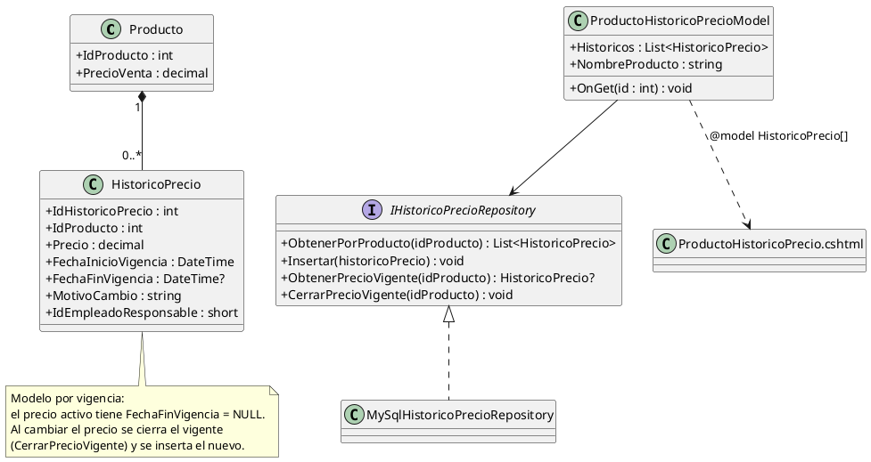

# Aplicación de Clean Code y Principios SOLID en un Proyecto de Software

**Sistema de Gestión Comercial — Ferretería Joel**

---

## Carátula

| Campo | Dato |
|-------|------|
| **Universidad** | [UNIVERSIDAD CATÓLICA BOLIVIANA — UCB] |
| **Materia** | [Materia, Sigla y sección] |
| **Docente** | [Nombre del docente] |
| **Semestre / Gestión** | [Semestre] — 2026 |
| **Integrantes** | [Nombre 1], [Nombre 2], [Nombre 3] |
| **Fecha de entrega** | 01/09/2026 |
| **Repositorio** | https://github.com/Macacofig/FERRETERIA-Joel |

---

# 1. Introducción

## 1.1 Breve explicación de los principios SOLID

SOLID es un acrónimo que reúne cinco principios de diseño orientado a objetos
propuestos por Robert C. Martin (Uncle Bob). Su objetivo es producir software
que sea fácil de **mantener**, **extender** y **probar**, reduciendo el acoplamiento
y la duplicación de código.

| Principio | Nombre | Idea central |
|-----------|--------|--------------|
| **S** | Single Responsibility Principle (Principio de Responsabilidad Única) | Una clase o método debe tener una sola razón para cambiar. |
| **O** | Open/Closed Principle (Principio Abierto/Cerrado) | Las entidades deben estar abiertas a la extensión pero cerradas a la modificación. |
| **L** | Liskov Substitution Principle (Principio de Sustitución de Liskov) | Una clase derivada debe poder sustituir a su clase base sin alterar el comportamiento esperado. |
| **I** | Interface Segregation Principle (Principio de Segregación de Interfaces) | Los clientes no deben verse obligados a depender de interfaces que no utilizan. |
| **D** | Dependency Inversion Principle (Principio de Inversión de Dependencias) | Depender de abstracciones, no de clases concretas. |

Además, el **Clean Code** (también popularizado por Robert C. Martin) aporta un
conjunto de buenas prácticas de estilo: nombres significativos, métodos pequeños,
código con intención clara, eliminación de código duplicado o muerto, y manejo
correcto de errores con mensajes legibles para el usuario final.

## 1.2 Objetivo del trabajo práctico

- Investigar y comprender los principios SOLID y las buenas prácticas de
  Clean Code.
- Aplicarlos de forma real en un sistema web con **Razor Pages + C# + ADO .NET**.
- Construir **CRUD completos** sobre 3 tablas (Productos, Categorías y
  Proveedores) de una ferretería, cada una con al menos 4 atributos
  independientes.
- Validar la **entrada de datos** con base en la **lógica de negocio** y con
  mensajes claros para el usuario.
- **Incorporar el control de datos históricos** en una de las tablas (histórico
  de precios de productos) con un modelo escalable que permita gestionar el
  historial a futuro, incluida una **vista que muestre el histórico de cambios**.
- Desarrollar la **ventana Home** con menú de opciones, logo y línea gráfica
  propia del negocio.
- Ordenar el trabajo en un **repositorio Git** (GitHub) con ramas temáticas y
  commits descriptivos.

---

# 2. Descripción del proyecto

## 2.1 Contexto y problemática a resolver

**Ferretería Joel** es un comercio dedicado a la venta de herramientas y
materiales de construcción. Su operación actual tiene las siguientes
características:

- **Venta por unidades y por fracción**: el cliente puede comprar productos al
  por mayor (una bolsa) o fraccionados (por ejemplo, *un montoncito de clavos*),
  lo que obliga al sistema a trabajar con unidades de medida y stock real.
- **Roles de empleados**:
  - Responsable de **caja**, que cobra las ventas.
  - Responsable de **almacén**, que revisa existencias, repone stock y se
    comunica con los proveedores de confianza.
  - Responsable de **atención al cliente**.
- **Flujo de compra actual (manual)**:
  1. El cliente consulta si el producto existe.
  2. El responsable de atención anota lo pedido en una **boleta**.
  3. El cliente paga en caja.
  4. Se le entrega la mercancía.

**Problemática identificada:**

- El control de inventario se hace **"a ojo"**; el responsable de almacén repone
  cuando percibe faltantes, sin datos confiables.
- La caja usa **talonario de ventas con copias**, sin facturación ni registros
  digitales.
- No existe un catálogo digital único de productos, categorías ni proveedores.
- No hay trazabilidad de los **cambios históricos** (por ejemplo, evolución de
  precios de un producto).

**Solución propuesta (alcance actual):** un sistema administrativo web modular
que ya cuenta con la **ventana Home** (marca, historia y estadísticas), el menú
de opciones y los **catálogos base** del negocio —Productos, Categorías y
Proveedores— con CRUD completo, validaciones de negocio y **histórico de
precios** del producto. La arquitectura queda lista para incorporar inventario,
ventas, compras y reportes.

## 2.2 Requisitos funcionales mínimos

| # | Requisito | Tabla | Evidencia en el código |
|---|-----------|-------|------------------------|
| R1 | Listar registros ordenados | Categorías | `Repositories/MySqlCategoriaRepository.cs` (`ORDER BY IdCategoria ASC`) |
| R2 | Listar registros ordenados | Productos | `Repositories/MySqlProductoRepository.cs` (`ORDER BY Nombre ASC`) |
| R3 | Listar registros ordenados | Proveedores | `Repositories/MySqlProveedorRepository.cs` (`ORDER BY NombreComercial ASC`) |
| R4 | Insertar con validación de negocio | Categorías | `Pages/CategoriaNueva.cshtml.cs` + `Validaciones/CategoriaValidaciones.cs` |
| R5 | Insertar con validación de negocio | Productos | `Pages/ProductoNuevo.cshtml.cs` + `Validaciones/ProductoValidaciones.cs` |
| R6 | Insertar con validación de negocio | Proveedores | `Pages/ProveedorNuevo.cshtml.cs` + `Validaciones/ProveedorValidaciones.cs` |
| R7 | Actualizar | Categorías | `Pages/CategoriaEditar.cshtml.cs` |
| R8 | Actualizar | Productos | `Pages/ProductoEditar.cshtml.cs` |
| R9 | Actualizar | Proveedores | `Pages/ProveedorEditar.cshtml.cs` |
| R10 | Eliminación lógica (soft delete) | Las 3 | `CambiarEstado()` / `Desactivar()` + handlers `OnPostEliminar` |
| R11 | Histórico de cambios con vista | Producto | `Repositories/MySqlHistoricoPrecioRepository.cs` + `Pages/ProductoHistoricoPrecio.cshtml` |
| R12 | Home + menú de opciones con logo | — | `Pages/Index.cshtml` + `Pages/Shared/_Layout.cshtml` |

Cada tabla implementada cumple con tener al menos **4 atributos independientes**
(sin contar claves ni atributos de auditoría):

| Tabla | Atributos independientes |
|-------|--------------------------|
| **Categoria** | Codigo, Nombre, Descripcion, PorcentajeGanancia (`Models/Categoria.cs`) |
| **Producto** | Codigo, Nombre, Descripcion, Marca, UnidadMedida, PrecioVenta (`Models/Producto.cs`) |
| **Proveedor** | RazonSocial, NombreComercial, Nit, NombreContacto, Telefono, CorreoElectronico, Direccion (`Models/Proveedor.cs`) |

Convención de auditoría común: `Estado`, `FechaRegistro` y `FechaActualizacion`
son tratados como atributos de auditoría (no se cuentan entre los independientes)
y en todos los repositorios los valores de `FechaActualizacion` se asignan con
`CURRENT_TIMESTAMP`/`NOW()` sin intervención de la lógica de la página.

---

# 3. Diseño e implementación

## 3.1 Diagrama de clases

### 3.1.1 Diagrama general (modelos, repositorios, ayudantes y validaciones)

```plantuml
@startuml
skinparam classAttributeIconSize 0
skinparam backgroundColor #FFFFFF

package "FERRETERIA__Joel.Models" {
  class Categoria {
    + IdCategoria : short
    + Codigo : string
    + Nombre : string
    + Descripcion : string?
    + PorcentajeGanancia : decimal
    + Estado : byte
    + FechaRegistro : DateTime
    + FechaActualizacion : DateTime?
    + IdEmpleadoResponsable : short
  }
  class Producto {
    + IdProducto : int
    + IdCategoria : short
    + Codigo : string
    + Nombre : string
    + Descripcion : string?
    + Marca : string?
    + UnidadMedida : string
    + PrecioVenta : decimal
    + Estado : byte
    + FechaRegistro : DateTime
    + FechaActualizacion : DateTime?
    + IdEmpleadoResponsable : short
  }
  class Proveedor {
    + IdProveedor : short
    + RazonSocial : string
    + NombreComercial : string
    + Nit : string
    + NombreContacto : string
    + Telefono : string
    + CorreoElectronico : string?
    + Direccion : string?
    + Estado : byte
    + FechaRegistro : DateTime
    + FechaActualizacion : DateTime?
    + IdEmpleadoResponsable : short
  }
  class Empleado {
    + IdEmpleado : short
    + Nombre : string
  }
  class HistoricoPrecio {
    + IdHistoricoPrecio : int
    + IdProducto : int
    + Precio : decimal
    + FechaInicioVigencia : DateTime
    + FechaFinVigencia : DateTime?
    + MotivoCambio : string
    + Estado : byte
    + FechaRegistro : DateTime
    + FechaActualizacion : DateTime?
    + IdEmpleadoResponsable : short
    + NombreProducto : string?
    + NombreEmpleadoResponsable : string?
  }
}

package "FERRETERIA__Joel.Repositories" {
  interface ICategoriaRepository {
    + ObtenerTodas() : List<Categoria>
    + ObtenerActivas() : List<Categoria>
    + ObtenerPorId(id : short) : Categoria?
    + Insertar(categoria : Categoria) : void
    + Actualizar(categoria : Categoria) : void
    + Desactivar(id : short) : void
  }
  class MySqlCategoriaRepository

  interface IProductoRepository {
    + ObtenerTodos() : List<Producto>
    + ObtenerPorId(idProducto : int) : Producto?
    + Insertar(producto : Producto) : int
    + Actualizar(producto : Producto) : void
    + CambiarEstado(idProducto : int) : void
    + ExisteCodigo(codigo, excluir?) : bool
    + ExisteCategoriaActiva(idCategoria) : bool
  }
  class MySqlProductoRepository

  interface IProveedorRepository {
    + ObtenerTodos() : List<Proveedor>
    + ObtenerPorId(idProveedor : short) : Proveedor?
    + Insertar(proveedor : Proveedor) : void
    + Actualizar(proveedor : Proveedor) : void
    + CambiarEstado(idProveedor : short) : void
    + ExisteNit(nit, excluir?) : bool
  }
  class MySqlProveedorRepository

  interface IEmpleadoRepository {
    + ObtenerActivos() : List<Empleado>
  }
  class MySqlEmpleadoRepository

  interface IHistoricoPrecioRepository {
    + ObtenerPorProducto(idProducto : int) : List<HistoricoPrecio>
    + Insertar(historicoPrecio : HistoricoPrecio) : void
    + ObtenerPrecioVigente(idProducto : int) : HistoricoPrecio?
    + CerrarPrecioVigente(idProducto : int) : void
  }
  class MySqlHistoricoPrecioRepository
}

package "FERRETERIA__Joel.Validaciones" {
  class CategoriaValidaciones {
    + EsCodigoValido(codigo) : bool
    + EsNombreValido(nombre) : bool
    + EsDescripcionValida(descripcion) : bool
    + EsPorcentajeGananciaValido(pct) : bool
    + EsEmpleadoValido(id) : bool
    + EsValida(categoria) : bool
  }
  class ProveedorValidaciones {
    + EsRazonSocialValida(rs) : bool
    + EsNombreComercialValido(nc) : bool
    + EsNitValido(nit) : bool
    + EsNombreContactoValido(nc) : bool
    + EsTelefonoValido(tel) : bool
    + EsCorreoValido(correo) : bool
    + EsEmpleadoValido(id) : bool
  }
  class ProductoValidaciones {
    + EsCodigoValido(codigo) : bool
    + EsNombreValido(nombre) : bool
    + EsUnidadMedidaValida(um) : bool
    + EsPrecioValido(precio) : bool
    + EsCategoriaValida(id) : bool
    + EsEmpleadoValido(id) : bool
  }
}

ICategoriaRepository <|.. MySqlCategoriaRepository
IProductoRepository <|.. MySqlProductoRepository
IProveedorRepository <|.. MySqlProveedorRepository
IEmpleadoRepository <|.. MySqlEmpleadoRepository
IHistoricoPrecioRepository <|.. MySqlHistoricoPrecioRepository

note right of ICategoriaRepository
  Program.cs registra las 5 abstracciones
  con AddScoped<Interface, Implementacion>
  (Inversión de dependencias en todo el sistema)
end note

@enduml
```



### 3.1.2 Diagrama de las páginas Razor (Page Models)

```plantuml
@startuml
skinparam classAttributeIconSize 0
skinparam backgroundColor #FFFFFF

package "FERRETERIA__Joel.Pages" {
  class CategoriasModel {
    - _repositorio : ICategoriaRepository
    + OnGet() : void
    + OnPostEliminar(id : short) : IActionResult
  }
  class CategoriaNuevaModel {
    + NuevaCategoria : Categoria
    + OnGet() : void
    + OnPost() : IActionResult
    - CargarEmpleados() : void
  }
  class CategoriaEditarModel {
    + CategoriaEdit : Categoria
    + OnGet(id : short) : IActionResult
    + OnPost() : IActionResult
    - CargarEmpleados() : void
  }
  class ProductosModel {
    + ListProductos : List<Producto>
    + Categorias : List<Categoria>
    + OnGet() : void
  }
  class ProductoNuevoModel {
    + Producto : Producto
    + OnGet() : void
    + OnPost() : IActionResult
    - NormalizarDatos() : void
    - Validar() : void
    - CargarCatalogos() : void
    - Insertar() : void  // inserta producto + precio inicial (histórico)
  }
  class ProductoEditarModel {
    + Producto : Producto
    + OnGet(id : int) : IActionResult
    + OnPost() : IActionResult
    - Validar() : void
    - CargarCatalogos() : void
    - Actualizar() : void  // actualiza producto + registra cambio de precio
  }
  class ProductoHistoricoPrecioModel {
    + Historicos : List<HistoricoPrecio>
    + NombreProducto : string
    + OnGet(id : int) : void
  }
  class ProveedoresModel {
    + ListProveedores : List<Proveedor>
    + OnGet() : void
    + OnPostEliminar(idProveedor : short) : IActionResult
  }
  class ProveedorNuevoModel {
    + Proveedor : Proveedor
    + OnGet() : void
    + OnPost() : IActionResult
    - NormalizarDatos() : void
    - Validar() : void
    - CargarEmpleados() : void
    - Insertar() : void
  }
  class ProveedorEditarModel {
    + Proveedor : Proveedor
    + OnGet(id : int) : IActionResult
    + OnPost() : IActionResult
    - NormalizarDatos() : void
    - Validar() : void
    - ObtenerPorId(id) : Proveedor?
    - Actualizar() : void
  }
}

CategoriasModel --> ICategoriaRepository
CategoriaNuevaModel --> ICategoriaRepository
CategoriaNuevaModel --> IEmpleadoRepository
CategoriaNuevaModel --> CategoriaValidaciones
CategoriaEditarModel --> ICategoriaRepository
CategoriaEditarModel --> CategoriaValidaciones
ProductosModel --> IProductoRepository
ProductosModel --> ICategoriaRepository
ProductoNuevoModel --> IProductoRepository
ProductoNuevoModel --> ICategoriaRepository
ProductoNuevoModel --> IEmpleadoRepository
ProductoNuevoModel --> IHistoricoPrecioRepository
ProductoNuevoModel --> ProductoValidaciones
ProductoEditarModel --> IProductoRepository
ProductoEditarModel --> ICategoriaRepository
ProductoEditarModel --> IEmpleadoRepository
ProductoEditarModel --> IHistoricoPrecioRepository
ProductoEditarModel --> ProductoValidaciones
ProductoHistoricoPrecioModel --> IHistoricoPrecioRepository
ProveedorNuevoModel --> IEmpleadoRepository
ProveedorNuevoModel --> ProveedorValidaciones
ProveedorEditarModel --> IEmpleadoRepository
ProveedorEditarModel --> ProveedorValidaciones
ProveedoresModel --> IProveedorRepository

note top of ProductosModel
  Los Page Models ya NO contienen SQL:
  toda la persistencia vive en los repositorios
  (en principio) y se inyectan por constructor.
end note

@enduml
```



### 3.1.3 Diagrama del control de datos históricos (implementado)



## 3.2 Justificación de las decisiones de diseño

1. **Patrón Repository con ADO .NET en todo el sistema.** Se definieron cinco
   interfaces (`ICategoriaRepository`, `IProductoRepository`,
   `IProveedorRepository`, `IEmpleadoRepository`, `IHistoricoPrecioRepository`)
   con sus implementaciones `MySql*`. Esto separa por completo la consulta SQL
   de la lógica de la página y permite cambiar la base de datos sin tocar las
   vistas.

2. **Validadores dedicados por entidad.** La carpeta `Validaciones/` agrupa
   clases con una única responsabilidad: decidir si un dato es válido según la
   lógica de negocio.

3. **Modelo de histórico por vigencia.** En lugar de guardar pares
   "precio anterior / precio nuevo", la tabla `historico_precio` guarda un
   registro por versión con `FechaInicioVigencia` y `FechaFinVigencia` (NULL =
   vigente). Este modelo es más simple de consultar y permite saber, en
   cualquier fecha, cuál era el precio de un producto.

4. **Eliminación lógica (soft delete).** Los repositorios de producto y
   proveedor implementan `CambiarEstado()` con un `CASE` que alterna el estado;
   las listas consultan únicamente los activos. Se preserva la integridad
   referencial y se habilita auditoría.

5. **Errores controlados con `ILogger` y mensajes genéricos.** Toda operación
   queda envuelta en `try/catch`; el detalle técnico se registra con el logger
   (con parámetros como `{IdProducto}`) y al usuario solo se muestra un mensaje
   claro y no sensible.

6. **Inyección de dependencias por constructor.** Las páginas reciben los
   repositorios, `IConfiguration` e `ILogger` por constructor; el contenedor de
   ASP.NET Core resuelve el ciclo de vida.

## 3.3 Aplicación de cada principio SOLID (con ejemplos reales del código)

### S — Single Responsibility (Responsabilidad Única)

El sistema separa responsabilidades en capas y en métodos pequeños:

- **El acceso a datos de cada entidad** vive exclusivamente en su repositorio.
  Por ejemplo, `MySqlProductoRepository` solo conoce el SQL de productos
  (`Repositories/MySqlProductoRepository.cs:6`).
- **La validación de cada entidad** vive en clases separadas
  (`Validaciones/CategoriaValidaciones.cs`, `Validaciones/ProductoValidaciones.cs`,
  `Validaciones/ProveedorValidaciones.cs`).
- **Métodos pequeños con una sola tarea** en los Page Models: `NormalizarDatos()`,
  `Validar()` y `CargarCatalogos()` en `Pages/ProductoNuevo.cshtml.cs:91-187`.
  El handler `OnPost()` solo orquesta: normaliza → valida → inserta → redirige.
- **`MapearProducto(reader)` / `MapearProveedor(reader)` / `MapearHistoricoPrecio(reader)`**
  son métodos privados únicos dentro de cada repositorio, responsables de
  convertir una fila (`MySqlDataReader`) en el modelo (por ejemplo
  `Repositories/MySqlProductoRepository.cs:325-371`).

### O — Open/Closed (Abierto/Cerrado)

El sistema está *abierto a la extensión* y *cerrado a la modificación* gracias a
las cinco abstracciones de repositorio. Si se desea migrar a SQL Server o a una
implementación en memoria para pruebas unitarias, solo se crea una nueva
implementación y se cambia el registro en `Program.cs:8-13`:

```csharp
// Program.cs — registro de todas las implementaciones
builder.Services.AddScoped<ICategoriaRepository, MySqlCategoriaRepository>();
builder.Services.AddScoped<IProductoRepository, MySqlProductoRepository>();
builder.Services.AddScoped<IProveedorRepository, MySqlProveedorRepository>();
builder.Services.AddScoped<IEmpleadoRepository, MySqlEmpleadoRepository>();
builder.Services.AddScoped<IHistoricoPrecioRepository, MySqlHistoricoPrecioRepository>();
```

Ninguna página Razor necesita modificarse cuando cambia la tecnología de
persistencia: cumplen la condición de estar *cerradas a la modificación*.

### L — Sustitución de Liskov (Liskov Substitution Principle)

Cada implementación concreta implementa el contrato completo de su interfaz y
respeta las invariantes que las páginas esperan. Por ejemplo,
`MySqlProductoRepository` implementa `IProductoRepository`
(`Repositories/IProductoRepository.cs:3`) y la página lo consume por la
abstracción (`Pages/Productos.cshtml.cs:28`):

```csharp
ListProductos = _productoRepository.ObtenerTodos();
```

Cualquier otra implementación de `IProductoRepository` (SQL Server, mock de
pruebas) puede **sustituir** a la actual sin alterar el comportamiento esperado
por la página.

### I — Segregación de Interfaces (Interface Segregation Principle)

Cada interfaz expone solo lo que su cliente necesita; no existen interfaces
"gordas". El mejor ejemplo es la granularidad del sistema:

```csharp
// Repositories/IEmpleadoRepository.cs
public interface IEmpleadoRepository
{
    List<Empleado> ObtenerActivos();          // una sola responsabilidad
}

// Repositories/IHistoricoPrecioRepository.cs
public interface IHistoricoPrecioRepository
{
    List<HistoricoPrecio> ObtenerPorProducto(int idProducto);
    void Insertar(HistoricoPrecio historicoPrecio);
    HistoricoPrecio? ObtenerPrecioVigente(int idProducto);
    void CerrarPrecioVigente(int idProducto);
}
```

Un Page Model que solo necesita el catálogo de empleados recibe
`IEmpleadoRepository` y no una interfaz amplia con métodos de pagos, reportes o
auditoría que no usa.

### D — Inversión de Dependencias (Dependency Inversion Principle)

Los módulos de alto nivel (páginas) dependen de **abstracciones**, no de clases
concretas. Ejemplo real en `Pages/ProductoEditar.cshtml.cs:28-40`:

```csharp
public ProductoEditarModel(
    IProductoRepository productoRepository,
    ICategoriaRepository categoriaRepository,
    IEmpleadoRepository empleadoRepository,
    IHistoricoPrecioRepository historicoPrecioRepository,
    ILogger<ProductoEditarModel> logger)
{
    _productoRepository = productoRepository;
    _categoriaRepository = categoriaRepository;
    _empleadoRepository = empleadoRepository;
    _historicoPrecioRepository = historicoPrecioRepository;
    _logger = logger;
}
```

La inyección se resuelve mediante el contenedor de DI de ASP.NET Core
(`Program.cs:8-13`) y **las páginas nunca instancian sus repositorios**,
evitando la dependencia directa sobre MySQL en la capa de presentación.

## 3.4 Clean Code aplicado

| Buena práctica | Ejemplo |
|----------------|---------|
| **Nombres con intención** | `CargarCatalogo()`, `CerrarPrecioVigente()`, `ExisteNit(...)`, `MapearProducto(...)` |
| **Métodos pequeños / una tarea** | `NormalizarDatos()`, `Validar()`, `Insertar()` en los Page Models |
| **Consultas como constantes** | `const string query = "..."` en todos los repositorios |
| **Lectura tipada del reader** | `reader.GetInt32(...)`, `reader.GetDecimal(...)`, `reader.GetDateTime(...)` |
| **Manejo seguro de nulos** | `(object?)Producto.Descripcion ?? DBNull.Value`; `reader["Campo"] == DBNull.Value ? null : ...` |
| **Construcción defensiva** | Lanzamiento claro si falta la cadena de conexión: `?? throw new InvalidOperationException("No se encontró la cadena de conexión MySqlConnection.")` |
| **Uso seguro de recursos** | `using MySqlConnection` / `using MySqlCommand` / `using MySqlDataReader` |
| **Manejo de errores** | `try/catch` con `ILogger.LogError(ex, "...{Id}...", id)` y mensajes genéricos al usuario |
| **Sin duplicación** | `Mapear*` por repositorio centraliza el mapeo de filas (DRY) |
| **Código muerto eliminado** | Commits específicos de limpieza en el historial del repositorio |

## 3.5 Control de datos históricos en una tabla (Producto)

**Tabla seleccionada:** **Producto** (la de mayor volatilidad de negocio, por los
cambios frecuentes de precio de venta).

**Modelo implementado — `historico_precio` por vigencia:**

| Campo | Descripción |
|-------|-------------|
| `IdHistoricoPrecio` | Clave primaria |
| `IdProducto` | Producto al que pertenece la versión |
| `Precio` | Precio que entró en vigor |
| `FechaInicioVigencia` | Cuándo empezó a regir ese precio |
| `FechaFinVigencia` | Cuándo dejó de regir (`NULL` = precio vigente) |
| `MotivoCambio` | Razón del cambio ("Precio inicial", "Cambio de precio") |
| `IdEmpleadoResponsable` | Quién registró el cambio |

**Flujo real en el código:**

1. **Al crear un producto** (`Pages/ProductoNuevo.cshtml.cs:173-187`), tras el
   `INSERT` se registra la primera versión con motivo *"Precio inicial"*:

```csharp
int idProducto = _productoRepository.Insertar(Producto);

HistoricoPrecio historicoPrecio = new()
{
    IdProducto = idProducto,
    Precio = Producto.PrecioVenta,
    MotivoCambio = "Precio inicial",
    IdEmpleadoResponsable = Producto.IdEmpleadoResponsable
};

_historicoPrecioRepository.Insertar(historicoPrecio);
```

2. **Al actualizar un producto** (`Pages/ProductoEditar.cshtml.cs:182-214`) se
   obtiene el precio vigente, se actualiza el producto y, si el precio cambió,
   se **cierra** el vigente y se inserta la nueva versión:

```csharp
HistoricoPrecio? precioVigente =
    _historicoPrecioRepository.ObtenerPrecioVigente(Producto.IdProducto);

_productoRepository.Actualizar(Producto);

bool cambioPrecio =
    precioVigente is null ||
    precioVigente.Precio != Producto.PrecioVenta;

if (cambioPrecio)
{
    if (precioVigente is not null)
    {
        _historicoPrecioRepository.CerrarPrecioVigente(Producto.IdProducto);
    }

    _historicoPrecioRepository.Insertar(new HistoricoPrecio
    {
        IdProducto = Producto.IdProducto,
        Precio = Producto.PrecioVenta,
        MotivoCambio = "Cambio de precio",
        IdEmpleadoResponsable = Producto.IdEmpleadoResponsable
    });
}
```

3. **Vista de histórico** (`Pages/ProductoHistoricoPrecio.cshtml`): una página
   Razor que lista los cambios del producto ordenados por fecha de inicio de
   vigencia. Muestra Precio, Inicio/Fin de vigencia (con el badge **"Vigente"**
   cuando `FechaFinVigencia` es `NULL`), Motivo y Empleado responsable. Es el
   acceso al histórico de cambios que exige la rúbrica.

Este modelo cumple el requisito de "gestionar el historial **a futuro**":
agregar una versión no obliga a tocar la estructura de la tabla `producto` ni a
reescribir el CRUD existente, y queda preparado para diferencias de precios,
reportes y la lógica de descuentos por compra mayorista.

---

# 4. Repositorio de control de versiones

## 4.1 URL del repositorio

- Repositorio: **https://github.com/Macacofig/FERRETERIA-Joel**
- Plataforma: GitHub (acceso otorgado al docente).

## 4.2 Organización del repositorio

El trabajo se organizó con **commits atómicos y descriptivos** siguiendo una
convención de mensajes con prefijos de tipo (`feat`, `fix`, `refactor`, `refact`),
y con **ramas temáticas** por funcionalidad:

| Rama | Propósito |
|------|-----------|
| `master` | Integración principal / versión estable |
| `Crud-de-Productos` | Desarrollo del CRUD de productos |
| `crud-categoria` | Desarrollo del CRUD de categorías |
| `CRUD-PROVEEDORES` | Desarrollo del CRUD de proveedores |
| `validaciones-categoria` | Validaciones del módulo de categorías |
| `datos-historicos` | Histórico de precios de productos |
| `origin/pagehome` | Ventana Home y menú de opciones |
| `Frontend-Productos` / `Frontend-Productos-SubRamaDeProductos` | Estilos y UI del módulo de productos |

Ejemplos del historial de commits (integración mediante *pull requests*):

```
e9c279e refat: Ultimos Refacts
3247a06 Merge pull request #9 from Macacofig/validaciones-categoria
0ef3346 refact: Proovedor SOLID
7428412 Merge pull request #8 from Macacofig/datos-historicos
67364aa feat: Historial de precios añadido
c83639c Merge pull request #7 from Macacofig/origin/pagehome
a0551f6 creacion del home
449f3c6 Merge pull request #6 from Macacofig/validaciones-categoria
e5f4d8e refact: Solid en Productos
dd6d99b feat: Agregar campo PorcentajeGanancia a Categoria
3783754 Feat: Ajuste en paleta de colores
cb673ac refactor: mejorar código y consultas del módulo de categorías
fgf8cde... (historial completo en GitHub)
```

Los commits tipo `refactor:`/`refact:` y la integración por *pull requests*
evidencian la evolución del código: el patrón Repository comenzó en Categorías
como piloto y luego se aplicó a Productos, Proveedores, Empleados e Histórico de
precios.

---

# 5. Conclusiones

## 5.1 Aprendizajes del grupo sobre el uso de SOLID

- La **inversión de dependencias combinada con el patrón Repository** simplificó
  el cambio de capa de datos: con unas pocas líneas de registro en `Program.cs`
  todo el sistema puede usar otra base de datos.
- Separar las **validaciones** en clases dedicadas hizo los Page Models mucho
  más legibles y permitió reutilizar reglas entre listado, creación y edición.
- El **principio de responsabilidad única** nos obligó a pensar "¿quién debe
  hacer esto?" antes de escribir cada método, lo que redujo clases "todopoderosas".
- La **segregación de interfaces** se volvió natural al crecer el sistema:
  interfaces pequeñas (`IEmpleadoRepository` con un solo método) fueron más
  fáciles de implementar y de sustituir.
- Aplicar SOLID **no** significa escribir más código, sino organizarlo mejor.

## 5.2 Dificultades encontradas

*Al arrancar no teníamos claro cómo separar la consulta SQL de la lógica de la
página. Marcamos a Categorías como piloto del patrón Repository y eso nos mostró
la práctica de la Inversión de Dependencias; después extendimos la misma
estructura a Productos, Proveedores, Empleados e Histórico de precios. Luego
tuvimos que combatir la duplicación de consultas (lo resolvimos centralizando la
lógica de repositorios y con la inyección por constructor) y el manejo de los
errores de unicidad de código/NIT pidiendo ambas cosas: validación propia antes
del `INSERT` y captura de la excepción MySQL 1062 para dar mensajes claros. Por
último, diseñar el histórico sin romper el CRUD nos obligó a pensar en
versiones y vigencia de precios en lugar de sobrescribir el dato.*

## 5.3 Recomendaciones para futuros trabajos

Basadas en el estado actual del código (patrón Repository completo e histórico
de precios ya implementados):

1. **Transacciones atómicas para el histórico.** En `ProductoEditarModel.Actualizar()`
   el `UPDATE` del producto y el cierre + inserción de histórico se ejecutan en
   dos operaciones separadas. Envolverlas en una sola transacción evitaría
   inconsistencias si una falla a mitad de camino (cuando ya exista un
   `IProductoRepository` con `BeginTransaction()`).
2. **Autenticación y roles.** Diferenciar caja, almacén y atención al cliente,
   alineados a las responsabilidades reales de la empresa. El menú y las páginas
   ya están preparados para condicionar acciones por rol.
3. **Módulos de negocio pendientes.** Inventario (movimientos con
   `StockAnterior`/`StockPosterior`), Ventas con boleta/recibo y **descuentos
   por compra mayorista** (el gerente pidió ver ventas, inventario, proveedores
   y poder contactarlos; esos flujos consumirán los repositorios ya existentes).
4. **Reportes para gerencia.** Reusar `IHistoricoPrecioRepository` y los
   listados ordenados para construir vistas de evolución de precios, márgenes
   por `PorcentajeGanancia` de categoría y top de productos.
5. **Pruebas unitarias gracias a DIP.** Implementar repositorios en memoria que
   implementen las interfaces permitirá probar validadores y Page Models sin
   base de datos.
6. **Migrar gradualmente a un ORM.** Sustituir el mapeo manual
   `MySqlDataReader → Modelo` por un ORM bajo la **misma** abstracción de
   repositorios, respetando el OCP.
7. **Tipado estricto de parámetros.** Reemplazar `AddWithValue` por
   `MySqlParameter` tipados mejora el rendimiento y la claridad de las consultas.

---

# 6. Bibliografía / Fuentes consultadas

1. MARTIN, Robert C. *Clean Code: A Handbook of Agile Software Craftsmanship.*
   Prentice Hall, 2008.
2. MARTIN, Robert C. *Agile Software Development, Principles, Patterns, and
   Practices.* Prentice Hall, 2002. (Fuente original de los principios SOLID).
3. MARTIN, Robert C. **The Principles of OOD (SRP, OCP, LSP, ISP, DIP)** —
   *Uncle Bob.* Disponible en: http://butunclebob.com/ArticleS.UncleBob.PrinciplesOfOod
4. MICROSOFT. *ASP.NET Core Razor Pages.* Documentación oficial.
   Disponible en: https://learn.microsoft.com/es-es/aspnet/core/razor-pages/
5. MICROSOFT. *Dependency injection in ASP.NET Core.* Documentación oficial.
   Disponible en: https://learn.microsoft.com/en-us/aspnet/core/fundamentals/dependency-injection
6. OXLEY, Anthony et al. **PlantUML — Class Diagram documentation.**
   Disponible en: https://plantuml.com/class-diagram
7. OWASP Foundation. *Input Validation Cheat Sheet.*
   Disponible en: https://cheatsheetseries.owasp.org/cheatsheets/Input_Validation_Cheat_Sheet.html